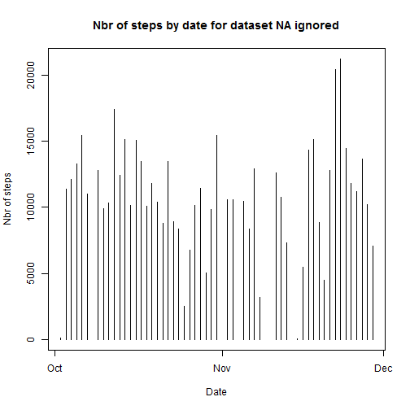
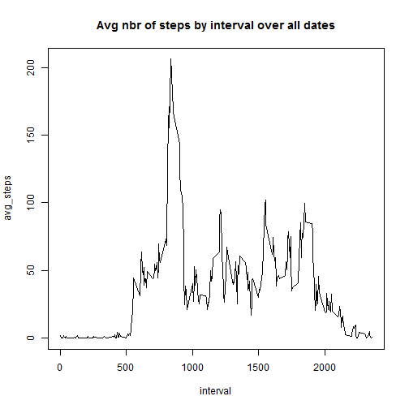
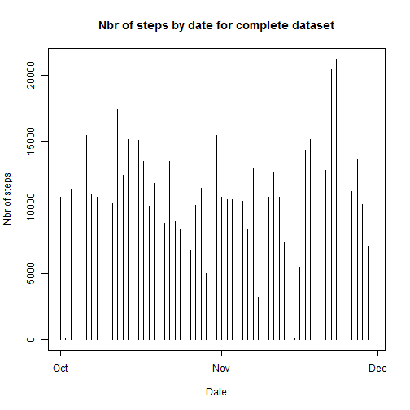
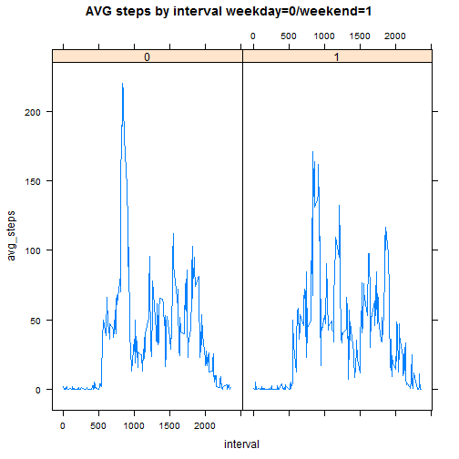

 
title: "Reproducible_research_Assignment_1"
author: "Guy Przytula"
date: "Sunday, July 13, 2014"
output: html_document
 
 Purpose of Assignment 
 
This assignment will be described in multiple parts. You will need to write a report that answers the questions detailed below. Ultimately, you will need to complete the entire assignment in a single R markdown document that can be processed by knitr and be transformed into an HTML file.
 
Throughout your report make sure you always include the code that you used to generate the output you present. When writing code chunks in the R markdown document, always use echo = TRUE so that someone else will be able to read the code. This assignment will be evaluated via peer assessment so it is essential that your peer evaluators be able to review the code for your analysis.
 
For the plotting aspects of this assignment, feel free to use any plotting system in R (i.e., base, lattice, ggplot2)
 
Fork/clone the GitHub repository created for this assignment. You will submit this assignment by pushing your completed files into your forked repository on GitHub. The assignment submission will consist of the URL to your GitHub repository and the SHA-1 commit ID for your repository state.
 
NOTE: The GitHub repository also contains the dataset for the assignment so you do not have to download the data separately.
 
 Start of File : 
 
- Loading and preprocessing the data : use read.csv steps date interval : df=activity : nrow=17568
- echo nbr of rows with missing data
- dataset with rows with steps=NA  = nna_activity : nrow = 15264
- dataset with rows with steps=!NA = na_activity  : nrow = 2304
- add column with date class
- Totalize the steps by date on na_activity : df=sum_na
- Display mean and median of this sum of steps by date
- Average the step by interval for all dates : df=avgsteps : nrow=288
- take the row that has most steps by interval and this returns
  interval = 835  avg_steps=206.1698 sum_steps = 10927
- convert toprow to matrix and remove colnames
- merge na_activity with avgsteps : df=mnna_activity : nrow=288
- rbind df=na_activity and mnna_activity : df=t_activity : nrow=17568
- add missing data to complete datase df=t_activity
- add a column wth day of week colname=day
- replace day with 0=weekday 1=weekend
- create new dataset with sum steps by date : full dataset df=sum_t
- echo mean and median of new dataset
 
 r code for previous list
 

```r
library(sqldf)
library(lattice)
activity<-read.csv("activity.csv")
cat("The total number of rows with NA s : ",nrow(activity[is.na(activity$steps),]))
```

```
## The total number of rows with NA s :  2304
```

```r
na_activity<-activity[!is.na(activity$steps),]
nna_activity<-activity[is.na(activity$steps),]
sum_na<-sqldf("SELECT date,sum(steps) as sum_steps from na_activity group by date")
sum_na$dt<-as.POSIXct(as.character(sum_na$date), format = "%Y-%m-%d")
cat("Mean of steps dataset NA ignored : ",mean(sum_na$sum_steps))
```

```
## Mean of steps dataset NA ignored :  10766
```

```r
cat("Median of steps dataset NA ignored : ",median(sum_na$sum_steps))
```

```
## Median of steps dataset NA ignored :  10765
```

```r
avgsteps<-sqldf("SELECT date,interval,avg(steps) as avg_steps from na_activity group by interval")
top<-as.matrix(head(sqldf("SELECT interval,avg(steps) as avg_steps,sum(steps) as sum_steps from na_activity group by interval order by sum_steps desc"),1))
top_no <- matrix(top,  dimnames = NULL)
cat("interval : ",top_no[1]," avg_steps : ",top_no[2]," sum_steps : ",top_no[3])
```

```
## interval :  835  avg_steps :  206.2  sum_steps :  10927
```

```r
mnna_activity<-sqldf("select avg_steps ,n.date,n.interval from nna_activity n join avgsteps a using(interval)")
colnames(mnna_activity)<-c("steps","date","interval")
t_activity<-rbind(na_activity,mnna_activity)
t_activity$dt<-as.POSIXct(as.character(t_activity$date), format = "%Y-%m-%d")
t_activity$day <- weekdays(as.Date(t_activity$dt))
t_activity$day<-gsub("Monday", "0", t_activity$day)
t_activity$day<-gsub("Tuesday", "0", t_activity$day)
t_activity$day<-gsub("Wednesday", "0", t_activity$day)
t_activity$day<-gsub("Thursday", "0", t_activity$day)
t_activity$day<-gsub("Friday", "0", t_activity$day)
t_activity$day<-gsub("Saturday", "1", t_activity$day)
t_activity$day<-gsub("Sunday", "1", t_activity$day)
sum_t<-sqldf("SELECT date,sum(steps) as sum_steps from t_activity group by date")
sum_t$dt<-as.POSIXct(as.character(sum_t$date), format = "%Y-%m-%d")
cat("Mean of steps total dataset : ",mean(sum_t$sum_steps))
```

```
## Mean of steps total dataset :  10766
```

```r
cat("Median of steps total dataset : ",median(sum_t$sum_steps))
```

```
## Median of steps total dataset :  10766
```

```r
t_avgsteps<-sqldf("SELECT day,interval,avg(steps) as avg_steps,day from t_activity group by day,interval")
```
 
 Requested plots :
 
- nbr of steps by date : for na_activity  !NA 
- nbr of steps by date : for t_activity   total df
- avg nbr of steps by interval over all dates
 
 r plot code
 
    
 
End of File
 
